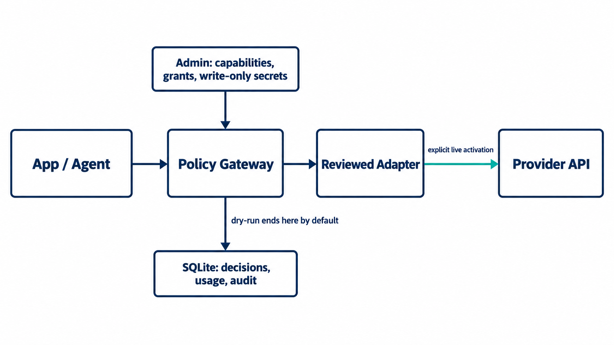

# API Hub

Local API capability control plane MVP. This source release excludes local
runtime databases, vault keys, credentials, and generated packages. It is not a
production secret vault.



Applications and agents request named capabilities through scoped tokens. The
Gateway checks grants and policy before routing to a reviewed adapter. Calls are
dry-run by default; a real provider call requires both a reviewed adapter and
explicit local activation. The control plane owns provider inventory, write-only
credential management, grants, usage, and audit. Provider secrets never enter
application or agent responses.

## Complete local workflow

1. Start the service and create the local administrator account.
2. Register a provider and its write-only credential state, then create and
   activate a capability.
3. Register an application, grant that capability, and issue a scoped token.
4. Discover the granted capability and invoke it through `/gateway/v1`.
   The default result is dry-run, with no provider network call.
5. Inspect the policy decision, usage, quota provenance, and audit record;
   revoke the application token and confirm it can no longer invoke.

The [product contract](PRODUCT_CONTRACT.md) defines the ownership and security
boundaries. [`docs/GATEWAY_API.md`](docs/GATEWAY_API.md) documents the invocation
contract; [`docs/NEW_SAAS_INTEGRATION.md`](docs/NEW_SAAS_INTEGRATION.md) is the
application onboarding path.

## Run from source

Node.js 22.13 or newer is required. From the repository root:

```powershell
npm start
```

Open `http://127.0.0.1:4310`. On first open, create the local administrator
account using the requirements shown on screen.

## Windows package

Run `npm run build:launcher`, then double-click `dist\API Hub Launcher.exe`.
It starts the hidden local service, opens the browser after health is ready,
and provides a tray **Stop and exit** action. See `docs/DESKTOP_LAUNCHER.md`.

For a Windows package that does not require Node.js to be installed, use
`npm run build:portable` and distribute `dist/API-Hub-Portable-win-x64.zip`.
The archive contains a bundled runtime, its own launcher, a file-integrity
manifest, and no development database, vault key, or `.env` file.

The login screen and authenticated control plane provide a `中文 / EN`
language switch. The selection is stored only in browser-local preferences and
does not translate or rewrite database records, audit evidence, or credentials.

The administrator password is stored only as a scrypt hash. Later visits restore
the HttpOnly local session. Workspace identity comes from that authenticated
session, not from a URL parameter.

The control plane persists its governed inventory server-side in the local
SQLite database at `data/runtime/api-hub.sqlite`. It demonstrates provider inventory,
write-only credential status, capability routing, project access, quota and
balance visibility, health, and audit. It is not yet a production secret vault.

Each installed instance is scoped to its authenticated owner workspace. The
Database view shows that workspace as a set of related collections. Runtime
database files are ignored by Git. Credential
values can be written through the Store credential dialog. They are encrypted
server-side with AES-256-GCM and are never returned. This local vault is not a
replacement for a production KMS or operating-system credential store.

Applications receive their own one-time gateway token from the Applications
view. They discover granted capabilities at `GET /gateway/v1/capabilities` and
invoke them at `POST /gateway/v1/invoke`. See `docs/GATEWAY_API.md` and the
zero-dependency, installable Node SDK built with `npm run build:sdk`. New projects
install the versioned `dist/local-api-hub-client-*.tgz` package and import
`@local/api-hub-client`; the package also provides the `api-hub` CLI. Gateway
Execution remains `dry_run` unless a reviewed adapter and an explicit local
activation record both exist. DeepSeek structured generation is enabled for the
authorized local development environment; see `docs/DEEPSEEK_DEVELOPMENT.md`.
Python, Go, Java, low-code tools, and client generators can fetch a live
token-scoped OpenAPI 3.1 contract from `GET /gateway/v1/openapi.json`; see
`docs/OPENAPI_INTEGRATION.md`.
The same package provides an `api-hub-mcp` stdio server that dynamically exposes
only the current application or agent token's granted capabilities. See
`docs/AGENT_MCP_INTEGRATION.md`.
The Gateway now passes through a default-locked execution engine that enforces
exact HTTPS-origin allowlists, reviewed adapter registration, bounded timeout and
retry policy, and a separate live activation gate. See
`docs/PROVIDER_ADAPTER_SECURITY.md`.

For every new product, follow `docs/NEW_SAAS_INTEGRATION.md`: register a distinct
application, grant least privilege, issue one token per runtime, discover allowed
capabilities, and revoke tokens when a runtime is retired.

For short-lived workers and autonomous agents, follow `docs/AGENT_IDENTITY.md`:
delegate only a subset of the parent application's current grants, use a
separate expiring `ah_agent_` token per runtime, and revoke it independently.

For every new API account, follow `docs/PROVIDER_ONBOARDING.md`. Provider metadata,
encrypted credential, quota provenance, and audit evidence are written atomically;
rotation remains a separate write-only action.

Provider usage updates preserve append-only quota, cost, and peak-RPM snapshots,
label their provenance, and drive resolvable threshold alerts. See
`docs/USAGE_AND_QUOTA.md`.

The dedicated Analytics page visualizes Gateway-observed calls by provider over
24 hours, 7 days, or 30 days, alongside provider share, allowed/denied decisions,
and average latency. Empty ranges remain visibly empty; the UI never fabricates traffic.

New business actions follow `docs/CAPABILITY_LIFECYCLE.md`: save a candidate,
review routing/data/retention contracts, explicitly activate it, then grant it to
individual applications. Candidates cannot be discovered or invoked.

The Security view lists active administrator sessions, supports confirmed
revocation, and rotates the password while invalidating every session. Persistent
login throttling and browser security headers are documented in
`docs/CONTROL_PLANE_SECURITY.md`.

Multi-device deployment and Mac Codex setup: see [docs/MULTIDEVICE.md](docs/MULTIDEVICE.md). Server requires Node >=22.13 (Node 24 recommended); clients need Node >=20. Existing local-only startup remains the default.
